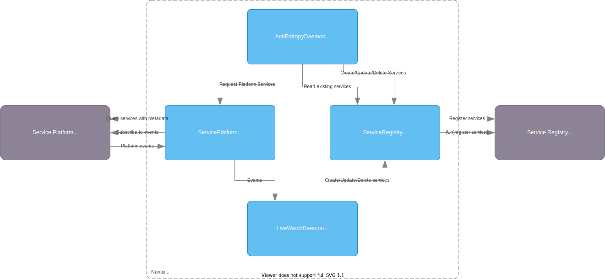

# Nuntio (balenae): Docker containers as consul services

Nuntio is a bridge between Docker containers and the Consul service catalog. 
It automatically registers/deregisters labelled Docker containers with Consul as they appear.

## Using Nuntio

Nuntio watches for new Docker containers and inspects them to determine what services they provide. Any services are added to a service registry.

Nuntio is highly extensible and configurable. It is possible to configure different platforms as service sources and to configure different service registries as targets.
The default application is a Docker platform and Consul service registry.

### Concepts

Nuntio uses a couple of abstract concepts throughout its code and documentation.

<dl>
<dt>Service</dt><dd>A service is anything that listens on a TCP or UDP port.</dd>
<dt>(Service) Platform</dt><dd>A platform is the thing that manages/runs processes that have services and can provide metadata about the process state (IP/port that it listens on, running or not, health status, ...).</dd>
<dt>(Service) Registry</dt><dd>A registry is the thing where services are stored in, so they can be queried by other applications.</dd>
<dt>Platform Service</dt><dd>A platform service is the application as seen by the Service Platform. Since a process can listen on multiple ports, it can contain multiple individual Services.</dd>
<dt>Registry Service</dt><dd>A registry service is the service as stored in the Service Registry. It maps to exactly one Service.</dd>
<dt>Check</dt><dd>A check is a component that checks the health of a Service. Checks can be handled by the Service Registry itself, or in Nuntio if the Service Registry does not support a check type.</dd>
<dt>Check Factory</dt><dd>A check factory creates Checks for a Service based on configuration. There are different kinds of checks possible, some can be handled by the Service Registry, other types can be handled by Nuntio.</dd>
</dl>



### Configuration options

Nuntio is a Spring Boot application. This means there are many ways to supply configuration parameters:

* Java system properties: use `-D<name>=<value>`
* Environment variables: replace all `.` with `_`
* Command-line arguments: use `--<name>=<value>`

Additional ways to supply configuration options is [documented in the Spring Boot documentation](https://docs.spring.io/spring-boot/docs/current/reference/html/features.html#features.external-config)

Most specific configuration options are dependent on the selected platform and registry and are documented there.

Only global configuration options are documented here.

<table>
<thead>
<tr>
<th>Option</th>
<th>Default</th>
<th>Description</th>
</tr>
</thead>
<tbody>
<tr>
<td><code>nuntio.engine.serviceAddress.[ipv4|ipv6]</code></td><td><code>true</code></td><td>Which type of service addresses will be registered in the service registry.</td>
</tr>
<tr>
<td><code>nuntio.engine.forcedTags</code></td><td><code>{}</code></td><td>Force-add comma-separated tags on all services</td>
</tr>
<tr>
<td><code>nuntio.engine.live.enabled</code></td><td><code>true</code></td><td>Enables watching the platform eventstream to immediately react to services changing state.</td>
</tr>
<tr>
<td><code>nuntio.engine.live.blocking</code></td><td><code>true</code></td><td>Enables blocking-mode watching of the eventstream. This option can be disabled to fall back to polling-mode operation in case there are problems with waking up blocked threads.</td>
</tr>
<tr>
<td><code>nuntio.engine.live.delay</code></td><td><code>1s</code></td><td>Time between checks in polling-mode watching.</td>
</tr>
<tr>
<td><code>nuntio.engine.antiEntropy.enabled</code></td><td><code>true</code></td><td>Enables anti-entropy scanning.</td>
</tr>
<tr>
<td><code>nuntio.engine.antiEntropy.delay</code></td><td><code>1m</code></td><td>Time between anti-entropy scans.</td>
</tr>
<tr>
<td><code>nuntio.engine.checks.heartbeat</code></td><td><code>true</code></td><td>Enable registration of heartbeat check.</td>
</tr>
<tr>
<td><code>nuntio.engine.checks.healthcheck</code></td><td><code>true</code></td><td>Enable registration of healthcheck check.</td>
</tr>
<tr>
<td><code>nuntio.engine.shutdownMode</code></td><td><code>UNREGISTER_CHECKS</code></td><td>
What actions nuntio should take when its process is terminated.

* <code>UNREGISTER_SERVICES</code>: Unregister all services that were registered by this nuntio instance.
* <code>UNREGISTER_CHECKS</code>: Unregister all checks for all services that were registered by this nuntio instance.
* <code>UNREGISTER_HEARTBEAT</code>: Unregister only the heartbeat check.
* <code>NOTHING</code>: Do not perform any special operation when shutting down.

</td>
</tr>
</tbody>
</table>


## Docker platform

The Docker platform registers services for containers with certain labels (or environment variables).

### Docker platform configuration

<table>
<thead>
<tr>
<th>Option</th>
<th>Default</th>
<th>Description</th>
</tr>
</thead>
<tbody>
<tr>
<td><code>nuntio.docker.enabled</code></td><td><code>true</code></td><td>Enable Docker platform</td>
</tr>
<tr>
<td><code>nuntio.docker.daemon.host</code></td><td>Platform-dependent</td><td>Connection string to the docker daemon (e.g.: <code>unix:///var/run/docker.sock</code>, <code>tcp://some-host:2375</code>)</td>
</tr>
<tr>
<td><code>nuntio.docker.daemon.tlsVerify</code></td><td><code>false</code></td><td>Enable/disable TLS verification (switch between http & https protocols)</td>
</tr>
<tr>
<td><code>nuntio.docker.daemon.certPath</code></td><td><code>null</code></td><td>Path to certificates needed for TLS verification</td>
</tr>
<tr>
<td><code>nuntio.docker.bind</code></td><td><code>PUBLISHED</code></td><td>Values: <code>PUBLISHED</code>/<code>INTERNAL</code>.

Which IP address/port to publish for containers.

* <code>PUBLISHED</code>: Only published ports are used. They are used with the host IP and bound port.
* <code>INTERNAL</code>: All exposed ports are used. They are used with the internal container IP and exposed port. If there are multiple internal container IPs (when the container is attached to multiple networks), no service will be published. To select a specific (e.g. overlay) network, a network filter can be specified with <code>nuntio.docker.bind.filter</code>.

</td>
</tr>
<tr>
<td><code>nuntio.docker.bind.filter</code></td><td><code></code></td><td>Only applicable for <code>INTERNAL</code> binds. Docker filters to determine which network(s) to use IP addresses for. Filters are comma-separated and the same format as in <code>docker network ls</code>. Only one network may match per-container.</td>
</tr>

<tr>
<td><code>nuntio.docker.nuntioLabel.enabled</code></td><td><code>true</code></td><td>Enables configuring services on Docker containers with labels following the [label specification](#docker-labels-for-nuntio)</td>
</tr>
<tr>
<td><code>nuntio.docker.nuntioLabel.prefix</code></td><td><code>nuntio.xenit.eu</code></td><td>Prefix for Nuntio labels.</td>
</tr>
<tr>
<td><code>nuntio.docker.registratorCompat.enabled</code></td><td><code>false</code></td><td>Enable compatibility with some registrator labels/environment variables. See [Registrator compatibility](#registrator-compatibility-mode) for details on which parts are implemented.</td>
</tr>
<tr>
<td><code>nuntio.docker.registratorCompat.explicit</code></td><td><code>false</code></td><td>Enables <code>-explicit</code> mode registrator compatibility, only registering containers that have service configurations present.</td>
</tr>

</tbody>
</table>

### Docker labels for Nuntio

Nuntio needs to know which services to register with which name, tags and metadata. This information is specified with labels on the docker container.

To avoid collisions with other uses for labels, they are namespaced under a configurable prefix (see `nuntio.docker.nuntioLabel.prefix`).

There are two options to specify labels:
 * Global: these labels apply to *all* services (published/exposed ports) on the Docker container.
 * Per-port: these labels apply only to the service with the matching exposed port on the Docker container.
   Port-specific labels are applied by appending the port number to the service prefix: `<prefix>/<port>`.
   If you have an UDP service, you need to specify it on the service prefix: `<prefix>/udp:<port>`

The labels follow these formats:

 * `<prefix>/service`: Comma-separated service names to use for this service. Required to be able to register a service.
 * `<prefix>/tags`: Comma-separated tag names to register with this service.
 * `<prefix>/metadata/<key>`: Metadata value to register with this service.
 * `<prefix>/check/<id>/<option>`: Configuration for checks to register with this service. 
   Note that a Check needs at least a `type` option to be valid *and* the type must be supported by a Check Factory.

Label examples

 * `nuntio.xenit.eu/service=my-service,other-service`: All ports of the container are registered under both `my-service` and `other-service`
 * `nuntio.xenit.eu/80/service=lb-front`: Port `80/tcp` of the container is registered under `lb-front`
 * `nuntio.xenit.eu/udp:53/tags=authoritative`: The services for port `53/udp` of the container will have the `authoritative` tag
 * `nuntio.xenit.eu/metadata/my-key=interesting-value`: The services for all ports of the container will have metadata value `my-key=interesting-value`
 * `nuntio.xenit.eu/check/poke/type=tcp`: Adds a check with id `poke` and option `type=tcp`

Some concrete examples:

```yaml
services:
   db1:
      image: postgres
      ports:
        - 1234:5432
      labels:
        nuntio.xenit.eu/service: db
        nuntio.xenit.eu/tags: primary
        nuntio.xenit.eu/metadata/hosted-dbs: metrics,users
        nuntio.xenit.eu/check/poke/type: tcp
   db2:
     image: postgres
     ports:
       - 1235:5432
     labels:
       nuntio.xenit.eu/5432/service: db,db-analytics
       nuntio.xenit.eu/5432/tags: secondary
       nuntio.xenit.eu/5432/metadata/hosted-dbs: metrics,users
       nuntio.xenit.eu/5432/check/poke/type: tcp
   app:
     image: my-app:latest
     ports:
       - 8080
       - 8081
       - 8082
     labels:
       nuntio.xenit.eu/8080/service: app-public
       nuntio.xenit.eu/8080/metadata/published-domain: my-awesome-app.example
       nuntio.xenit.eu/8081/service: app-admin
       nuntio.xenit.eu/metadata/prometheus-scrape: /metrics/prometheus
       nuntio.xenit.eu/8081/check/readiness/type: http
       nuntio.xenit.eu/8081/check/readiness/url: /actuator/health/readiness
       nuntio.xenit.eu/8081/check/readiness/method: GET
   custom-dns:
      image: my-dns-server:latest
      ports:
        - 10.5.2.1:53:5300/udp 
      labels:
        nuntio.xenit.eu/udp:5300/service: dns
```

This will register the following services:

 * `db` 
   * instance db1: `ServicePort=1234 Tags=primary Meta[hosted-dbs]=metrics,users Check[poke]=TCP:[mapped IP & port for 1234]`
   * instance db2: `ServicePort=1235 Tags=secondary Meta[hosted-dbs]=metrics,users Check[poke]=TCP:[mapped IP & port for 1234]`
 * `db-analytics`
   * instance db2: `ServicePort=1235 Tags=secondary Meta[hosted-dbs]=metrics,users Check [poke]=TCP:[mapped IP & port for 1234]`
 * `app-public`
   * instance app: `ServicePort=[mapped port for 8080] Meta[published-domain]=my-awesome-app.example Meta[prometheus-scrape]=/metrics/prometheus`
 * `app-admin`
   * instance app: `ServicePort=[mapped port for 8081] Meta[prometheus-scrape]=/metrics/prometheus Check[readiness]=HTTP:GET [mapped IP & port for 8081]/actuator/health/readiness`
 * `dns`
   * instance custom-dns: `ServiceIp=10.5.2.1 ServicePort=53`  
 

### Registrator compatibility mode

To ease migration from [registrator](https://gliderlabs.github.io/registrator/latest/) to Nuntio, parts of the registrator model are supported.

Compatibility can be enabled with the `nuntio.docker.registratorCompat.enabled=true`.

Following registrator features are supported for both labels and environment variables:

 * `SERVICE_IGNORE`: If this variable is present, no services on this container will be registered.
 * `SERVICE_<port>_IGNORE`: If this variable is present, the service on the port is not registered.
 * `SERVICE_NAME`, `SERVICE_<port>_NAME`: Setting a service name. If `SERVICE_NAME` is used and multiple services are present, the service name will be suffixed with the internal port.
 * `SERVICE_TAGS`, `SERVICE_<port>_TAGS`: Setting service tags.
 * `SERVICE_<meta>`, `SERVICE_<port>_<meta>`: Setting service metadata values.

Following registrator configuration options are supported:
 * `-internal`: Use `nuntio.docker.bind=INTERNAL` to register internal IP and port instead of the host mapped ones.
 * `-explicit`: Use `nuntio.docker.registratorCompat.explicit=true`
 * `-tags`: Use `nuntio.engine.forcedTags` to force-enabled tags on services

## Consul registry

The Consul registry supports registering services to Consul.

### Consul registry configuration

<table>
<thead>
<tr>
<th>Option</th>
<th>Default</th>
<th>Description</th>
</tr>
</thead>
<tbody>
<tr>
<td><code>nuntio.consul.enabled</code></td><td><code>true</code></td><td>Enable Consul registry</td>
</tr>
<tr>
<td><code>nuntio.consul.host</code></td><td><code>localhost</code></td><td>Hostname of the local Consul agent</td>
</tr>
<tr>
<td><code>nuntio.consul.port</code></td><td><code>8500</code></td><td>Port of the Consul HTTP API</td>
</tr>
<tr>
<td><code>nuntio.consul.token</code></td><td><code>null</code></td><td>ACL token for the Consul HTTP API</td>
</tr>
<tr>
<td><code>nuntio.consul.checks.[heartbeat|pause|healthcheck].ttl</code></td><td>

* heartbeat: <code>24h</code>
* pause: <code>5m</code>
* healthcheck: <code>5m</code>

</td><td>TTL before a check type expires and is considered critical.</td>
</tr>
<tr>
<td><code>nuntio.consul.checks.[heartbeat|pause|healthcheck].deregisterCriticalServiceAfter</code></td><td>

* heartbeat: <code>72h</code>
* pause: <code>null</code>
* healthcheck: <code>null</code>

</td><td>Time before a critical check deregisters the service.</td>
</tr>
</tbody>
</table>

### Consul checks

The consul Service Registry has a Check Factory that can create checks for the following types.
Check types are supported with and without `consul:` prefix.

Some Check types have mandatory options that will result in an error when they are not set.

<table>
<thead>
<tr>
<th>Check type</th>
<th>Option</th>
<th>Default</th>
<th>Description</th>
</tr>
</thead>
<tbody>
<tr>
<td><code>tcp</code>, <code>http</code></td>
<td><code>interval</code></td>
<td><em>Required</em></td>
<td>Interval between check attempts</td>
</tr>
<tr>
<td><code>tcp</code>, <code>http</code></td>
<td><code>timeout</code></td>
<td><code>10s</code></td>
<td>Timeout before the connection is considered failed</td>
</tr>
<tr>
<td><code>http</code></td>
<td><code>scheme</code></td>
<td><code>http</code></td>
<td>Scheme to use for HTTP check (<code>http</code> or <code>https</code>)</td>
</tr>
<tr>
<td><code>http</code></td>
<td><code>method</code></td>
<td><code>GET</code></td>
<td>HTTP method to use for the HTTP check</td>
</tr>
<tr>
<td><code>http</code></td>
<td><code>path</code></td>
<td><code>/</code></td>
<td>Path to use for the HTTP check</td>
</tr>
</tbody>
</table>
